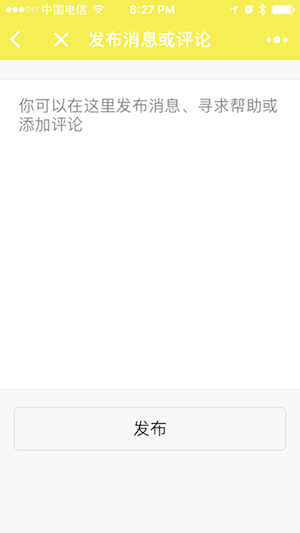
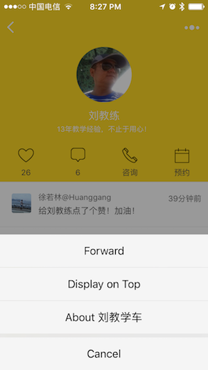

# 微信小程序 《刘教学车》 - 仲谋科技 孙•仲谋™

> 实际运行截图如下

 

 

 

 

## 如何运行源码

* 需要下载微信官方小程序模拟器。[下载地址](https://mp.weixin.qq.com/debug/wxadoc/dev/devtools/download.html)
* 下载源码，用官方工具创建空AppID项目，可本地查看

## 线上版本查看

 
 

# 合作

如果你也想拥有自己的小程序，欢迎联系我们。

