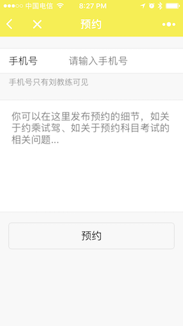

# 微信小程序 《刘教学车》 - 仲谋科技 孙•仲谋™

 
 
 
 

============================================================================

Source code of our home page for [仲谋科技](https://www.sunzhongmou.com) 

## How to run this on your local machine (MacOS for example)

* Install **hugo** on Mac with `brew install hugo`
* clone this repository to your local machine with `git clone https://github.com/sunzhongmou/homepage.git`
* change in the new dir with `cd homepage`
* and then run with `hugo server`
* hit the homepage with any browser from `http://localhost:1313/homepage/public/`

## How to preview this current version

* simply click on [demo](https://www.sunzhongmou.com)

## How to develop this homepage further

* read the [Beginners Guide of Hugo](https://gohugo.io/overview/quickstart/) first
* modify the theme in [partials](https://github.com/sunzhongmou/homepage/themes/hugo-creative-theme/layouts/partials) and [static](https://github.com/sunzhongmou/homepage/themes/hugo-creative-theme/static) if needed
* edit the [config file](https://github.com/sunzhongmou/homepage/config.toml) to your needs

# Adding content

## News posts

Just do `hugo new news/<name>.md` to create the respective news entry.
Each news entry has a `news_archive` property that lets the user look through previous news entries via archive. To create an archive, issue `hugo new news-archive/<month>_<year>.md` and modify the other settings. The most important one is the `archive` settings that lets HUGO associate the entries correctly.

## Other content

Not all content can be easily extended. All pages are based on markdown files in the `content` directory. There are two types of content:

* "Dynamic" content
* "Static" content

"Static" content is content that heavily interacts with its base template. For example the template will only insert most of the content by itself and only take the content of the markdown file for some description.

"Dynamic" content will be created completely by the markdown file and is indicated by `type = "<anything>-post"`

# Translation

The homepage was designed to support translation. To translate the homepage, create a fork and edit the current language in `config.toml`. Also don't forget to modify the list of available languages and send your modifications upstream. Unfortunately there's no better way to create translations using HUGO.

All content was created to allow translation without skimming though the HTML templates. Just translate the entries in `config.toml` and all files in `content`.
